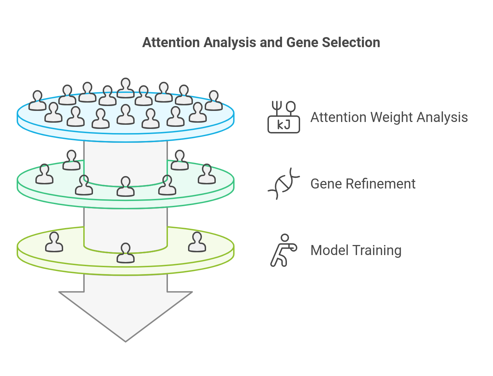

# Graph Attention Autoencoder for MultiOmics Integration, Risk Stratification, and Biomarker Identification in Cancer

**This software is licensed under a [Custom License Agreement](LICENSE). © 2024 Vatsal Patel. All rights reserved.**

## Overview

This repository contains the codebase for our research project titled **"Graph Attention Networks for Biomedical Insights: MultiOmics Integration for Risk Stratification and Biomarker Identification"**. The project leverages advanced Graph Attention Networks (GATs) to integrate and analyze multiomic data types, such as gene expression, mutations, methylation, and copy number alterations, with a primary focus on head and neck squamous cell carcinoma (HNSCC).

## Key Insights and Methodology


#### Cohort and Cancer Type:
- **Patients**: Derived from the TCGA-HNSCC dataset.
- **Samples**: Approximately 430 patient samples.

#### Multi-omics Features per Gene (Node Features):
Each gene is represented as a single node with a 17-dimensional feature vector comprising:
- **Gene Expression**: Standardized and normalized to [0,1].
- **Copy Number Alteration (CNA)**: Encoded from -2 to 2, linearly mapped to [0,1].
- **Mutations**: Binary encodings for mutations, including frame shift, in-frame changes, missense, nonsense, silent, and other mutation types.
- **Methylation Patterns**: Values from six genomic regions (1st exon, 3’UTR, 5’UTR, gene body, TSS1500, TSS200).

#### Gene Node Processing


#### Construction of Patient-Specific Gene Networks


### Methodology Overview

**Encoder**:
- Employs GATv2Conv layers to reduce the 17D features into a 1D latent embedding per gene.
- Uses an attention mechanism to prioritize biologically relevant gene-gene interactions.

**Decoder**:
- Reconstructs both node features and edge weights from the learned latent embeddings.
- Training is guided by a composite loss, combining:
  - Node reconstruction loss.
  - Edge presence reconstruction loss.
  - Edge weight reconstruction loss.

**Outcome**:
- Reduces multi-omics data into a single latent dimension per gene per patient (2,784 latent features per patient).
- Achieves a high cosine similarity (≥0.8) between input and reconstructed features.

### Feature Extraction and Patient Clustering


- **Latent Representation**: Each patient is represented by a 2,784-dimensional latent vector.
- **Clustering**: K-means clustering identifies initial groups, later refined to three distinct survival-linked clusters based on statistical testing.

### Risk Stratification and Biomarker Identification
- **Attention Analysis**: High-attention edges reveal significant gene-gene interactions across patients.
- **Gene Selection**: Attention-based filtering identifies 70 genes strongly associated with distinct survival outcomes.
- **Predictive Modeling**: Models trained on these genes achieve:
  - Multi-class classification AUC > 0.9.
  - Binary classification (high-risk vs. lower-risk) AUC ~0.98.

### Results


### Key Outcomes
- **Integrated Multi-omics**: Combines gene expression, mutations, CNA, and methylation into a unified latent representation.
- **Patient Stratification**: Identifies patient subgroups with significant survival differences.
- **Biomarker Discovery**: Highlights potential biomarkers for precision oncology.

## Repository Structure

- **`data/`**: Contains necessary datasets (Note: Large files like `.pth` are not tracked).
- **`models/`**: Includes the models developed during the study.
- **`results/`**: Stores outputs from the models, including figures and summaries.
- **`graph_autoencoder.py`**: Implements the Graph Autoencoder model.
- **`HyperParameterSearch.py`**: Script for hyperparameter tuning of models.
- **`train.py`**: Main training script for the Graph Attention Network.
- **`OmicsConfig.py`**: Configuration file for multiomics data preprocessing and modeling.
- **`GraphAnalysis.py`**: Tools for analyzing graph structures and outputs.

## Installation and Usage

### Installation

1. Clone the repository:
   ```bash
   git clone https://github.com/your-username/Graph-Attention-Autoencoder-for-MultiOmics-Analysis.git
   cd Graph-Attention-Autoencoder-for-MultiOmics-Analysis
   ```

2. Install required dependencies:
   ```bash
   pip install -r requirements.txt
   ```

### Training

Run the main training script:
```bash
python train.py
```

### Example Usage

Below is an example of how to load and use the pre-trained model:

```python
from torch_geometric.data import DataLoader
from model import GraphAutoencoder

# Load model
model_path = 'path_to_model.pth'
gae = GraphAutoencoder(in_channels=17, edge_attr_channels=1, out_channels=1, original_feature_size=17)
gae.gae.load_state_dict(torch.load(model_path))
gae.gae.eval()

# Example inference
output = gae.gae(data.x, data.edge_index, data.edge_attr)
```

## Contact

For further information or queries, please contact:
- **Vatsal Pravinbhai Patel** (vatsal1804@gmail.com)

## Citation

If you use this repository in your research, please cite as follows:

> Patel, V. P., & Biswas, N. K. (2024). Graph Attention Networks for Biomedical Insights: MultiOmics Integration for Risk Stratification and Biomarker Identification. Zenodo. https://doi.org/10.5281/zenodo.14357409

---

Thank you for exploring our work. We hope this repository aids your research!
